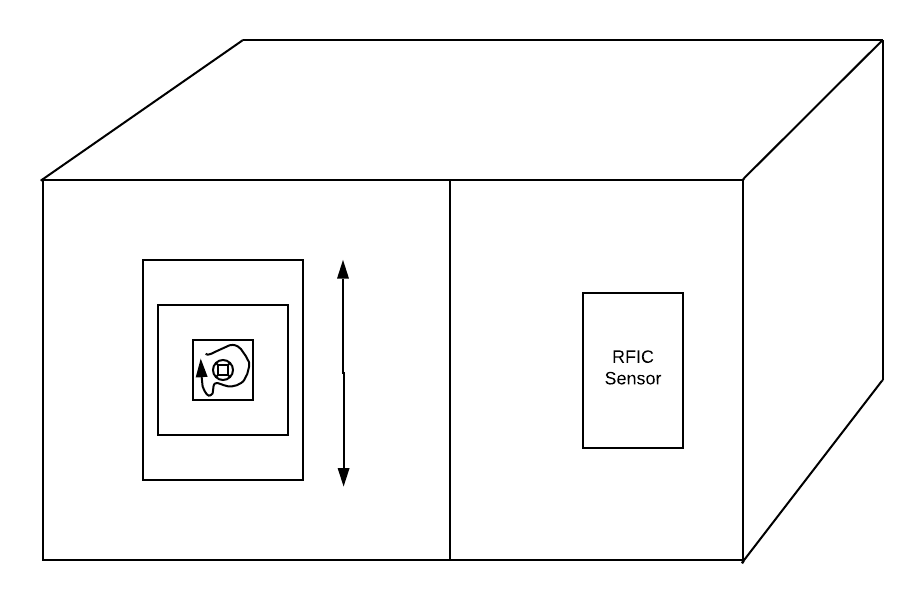

# Vending Machine Project

For this project, I created a vending machine with the help of two stepper motors, an RFID sensor, two buttons, and an Arduino. 
The idea would be that people can come and scan a card, then press either of two buttons to trigger the vending machine to 
dispense the item of their choosing.

## The Original Design

## Steps that I took:
1. Create two spirals for dispensing items from vending machine
2. Wire up the RFID sensor so a card is scannable.
3. Cut out the wood pieces for the vending machine.
4. Assemble the wood pieces and design the vending machine
5. Add the stepper motors into the motor shield
6. Create holes in the wood for placing the buttons for dispensing
7. Wire up the buttons
8. Assemble everything

## Problems I came across:
At first, I tried to use a breakout RFID board for the project, but nothing worked. Arduino kept saying that it couldn't find
the breakout board. We finally decided to switch into the RFID shield. However, it would of been more convenient with the 
breakout board because I would have the freedom to attach it anywhere on the vending machine since I can extend the wires.
However, despite this working on its own, towards the coming of the IM show, the RFID sensor decided not to work at all. 
I couldn't find the issue, but in the end, I think it was because the buttons getting power from the shield was somehow 
messing with the sensor. Because of that, I used another Arduino to help with the power. 

Another problem I had was with making the spiral for the vending machine. I tried multiple methods to make them and the 
first attempt was to use a clothing hanger from the junk bin that I found so that I can form it into a spiral. However, that 
didn't work because it was almost impossible to twist. The second method I tried was with arcylic, which I heated up with the 
heat gun. It worked fine, but I couldn't find an arcylic piece long enough to twist into a long enough spiral for the vending 
machine. I then found then material in the IM closet that looked like metal string, but it was actually not strong enough to
be able to hold any items. At last, Michael was able to help me find a material that was strong enough and malable enough 
for twisting.

Lastly, the stepper motors were giving me some trouble beacuse one of them turned very loudly. I thought it was because of the
spiral hitting onto the wood, but it turns out that wasn't the issue. All it took was switching out the motor for another one.

For the final showcase, everything worked. I left some candy and gum in the machine for people to take. The downside was that
I left the buttons a bit hidden under the RFID sensor, so it wasn't intuitive for people to press the button. I had to tell
them where they were, but afterwards, they knew what to do.
